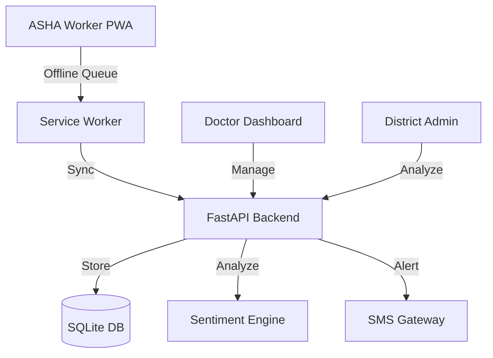

# 🌸 MATRUVANI (ಮಾತೃವಾಣಿ)
### Bridging the Gap in Perinatal Mental Health with AI & Empathy

[](https://reactjs.org/)
[](https://fastapi.tiangolo.com/)
[](https://web.dev/progressive-web-apps/)
[](#)

**MATRUVANI** is a mission-critical digital health platform designed to detect and manage **Perinatal Mood and Anxiety Disorders (PMADs)** in rural and semi-urban India. By empowering frontline health workers (ASHA workers) with AI-assisted screening tools, we transform a complex clinical process into a simple, empathetic conversation.

---

## 🚀 The Vision
In India, nearly **1 in 5** new mothers suffer from postpartum depression, yet over **90%** go undiagnosed due to stigma and a lack of trained professionals. MATRUVANI bridges this "empathy gap" by bringing clinical-grade screening directly to the mother's doorstep.

## ✨ Key Features

### 👩‍⚕️ For ASHA Workers (Frontline Heroes)
- **Guided EPDS Screening**: A simplified, multi-lingual version of the Edinburgh Postnatal Depression Scale.
- **Voice-First AI**: Mothers can speak freely about their feelings in their native tongue; our AI analyzes the sentiment and identifies risk markers.
- **Offline-First Resilience**: Works perfectly in areas with zero connectivity, syncing data once back in range.
- **Instant Referral**: One-tap referral system that sends SMS alerts to local PHC Doctors.

### 🏥 For Doctors & PHCs
- **Triage Dashboard**: Real-time view of high-risk cases in their jurisdiction.
- **Session Insights**: Full screening history including AI-transcribed voice notes for deeper clinical context.

### 📊 For District Administrators
- **Heatmaps**: Geographic visualization of mental health trends across the district.
- **Coverage Analytics**: Monitor screening rates and ASHA performance by sub-centre.

---

## 🛠️ Technology Stack

| Layer | Technology |
| :--- | :--- |
| **Frontend** | React 18, Vite, Tailwind CSS, Lucide Icons, Zustand (State) |
| **Backend** | FastAPI (Python), SQLModel, SQLite |
| **PWA** | Vite-PWA-Plugin, Workbox (Background Sync & Caching) |
| **AI/ML** | Speech-to-Text API, Sentiment Analysis Engine |
| **Communication** | Twilio/Fast2SMS Integration |

---

## 💎 Novelty & Industry-Grade Innovations

MATRUVANI isn't just a digital form; it's a sophisticated clinical decision support system.

- **Linguistic Divergence Detection (LDD)**: Our AI compares the structured EPDS score with the sentiment of the mother's free-flowing speech. If a mother "under-reports" her symptoms in the questionnaire but expresses deep distress in speech, the system flags a "Divergence," ensuring no mother is missed due to social desirability bias.
- **Privacy-Preserving Architecture**: Designed with India's **DPDP Act 2023** in mind. Anonymous mother tokens are used for screening, ensuring that sensitive mental health data is never directly linked to PII on the primary storage layer.
- **Frontline Triage**: Automates the work of a psychiatrist for initial screening, reducing the burden on PHC Doctors by providing them with a pre-triaged list of "High Priority" cases.

---

## 🏗️ Architecture


---

## 🌍 Localization Excellence
Mental health is deeply cultural. MATRUVANI supports:
- **English** | **Hindi** (हिंदी) | **Kannada** (ಕನ್ನಡ) | **Telugu** (తెలుగు) | **Marathi** (मराठी) | **Tamil** (தமிழ்) | **Bengali** (বাংলা)

---

## 🏁 Getting Started

### Prerequisites
- Python 3.9+
- Node.js 18+

### Setup

1. **Clone the Repo**
   ```bash
   git clone https://github.com/your-repo/matruvani.git
   cd matruvani
   ```

2. **Backend Setup**
   ```bash
   cd backend
   python -m venv venv
   source venv/bin/activate # or .\venv\Scripts\activate on Windows
   pip install -r requirements.txt
   uvicorn main:app --reload
   ```

3. **Frontend Setup**
   ```bash
   cd frontend
   npm install
   npm run dev
   ```

---

## 🌟 Why MATRUVANI
- **Scalable**: Built on lightweight, modern tech.
- **Localized**: Breaks script and dialect barriers.
- **Impactful**: Addresses a massive, overlooked public health crisis.
- **Ready**: PWA deployment means it's an app on any phone in seconds.

---
*Created for the WitchHunt AI Hackathon 2026 | AI4India | HopeWorks Foundation. Empowering mothers, one conversation at a time.*
